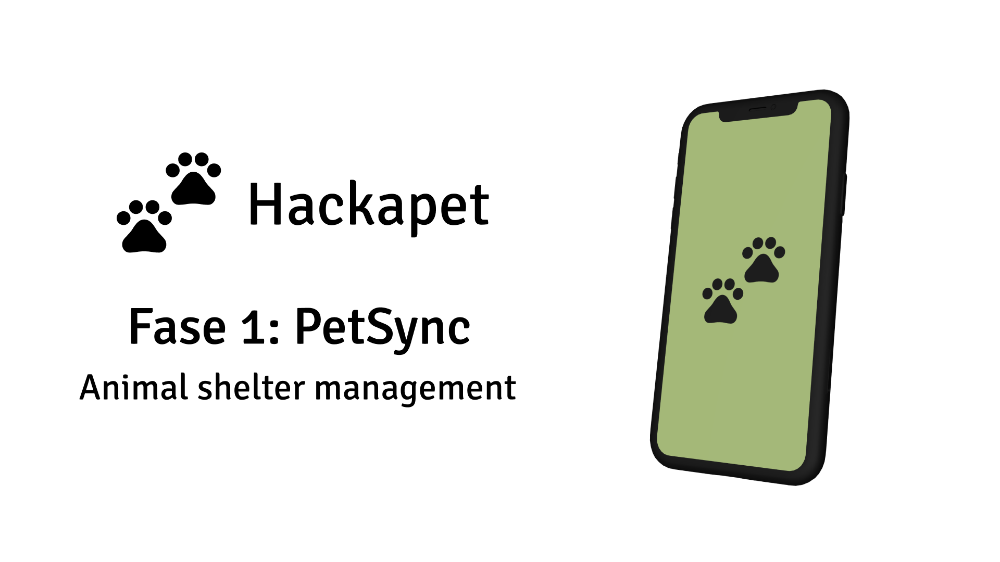

# PetSync Android



Phase 1 of the Hackapet Android project.

## Table of Contents

1. [Project Purpose](#project-purpose)
2. [Environment Setup](#environment-setup)
   - [Git](#git)
   - [GitHub and GitLab Accounts](#github-and-gitlab-accounts)
   - [Android Studio](#android-studio)
3. [Instructions by Operating System](#instructions-by-operating-system)
   - [Linux](#linux)
   - [Mac](#mac)
   - [Windows](#windows)
4. [Verification](#verification)
5. [Additional Resources](#additional-resources)

## Project Purpose

PetSync Android is Phase 1 of the Hackapet project for Android devices. This application aims to optimize animal shelter management through an efficient record-keeping system that streamlines daily operations.

Key features:
- Tracking of animals in the shelter
- Supply inventory
- Report generation

## Environment Setup

### Git

Git is essential for version control. It allows you to track changes in your code, collaborate with others, and manage your code repositories.

### GitHub Account

You'll need an account on GitHub to collaborate on the project and access repositories.

### Android Studio

Android Studio is the official IDE for Android development and is necessary for working on this project.

## Instructions by Operating System

### Linux

1. **Install Git:**
   ```
   sudo apt-get update
   sudo apt-get install git
   ```

2. **Configure Git:**
   ```
   git config --global user.name "Your Name"
   git config --global user.email "your_email@example.com"
   ```

3. **Install Android Studio:**
   - Download Android Studio from [the official page](https://developer.android.com/studio).
   - Extract the downloaded file and move it to your applications directory.
   - Run the `studio.sh` script in the `bin` folder to start Android Studio.

### Mac

1. **Install Git:**
   ```
   /bin/bash -c "$(curl -fsSL https://raw.githubusercontent.com/Homebrew/install/HEAD/install.sh)"
   brew install git
   ```

2. **Configure Git:**
   ```
   git config --global user.name "Your Name"
   git config --global user.email "your_email@example.com"
   ```

3. **Install Android Studio:**
   - Download Android Studio from [the official page](https://developer.android.com/studio).
   - Move the Android Studio app to your Applications folder.
   - Open Android Studio and follow the setup wizard.

### Windows

1. **Install Git:**
   - Download Git from [git-scm.com](https://git-scm.com/download/win).
   - Run the installer and follow the setup wizard.

2. **Configure Git:**
   ```
   git config --global user.name "Your Name"
   git config --global user.email "your_email@example.com"
   ```

3. **Install Android Studio:**
   - Download Android Studio from [the official page](https://developer.android.com/studio).
   - Run the installer and follow the setup wizard.

## Verification

After installation, verify that everything is working correctly:

1. **Check Git installation:**
   ```
   git --version
   ```

2. **Verify GitHub/GitLab access:**
   Try cloning a repository:
   ```
   git clone git@github.com:username/repository.git
   ```

3. **Test Android Studio:**
   Create a new Android project and run it on an emulator.

## Additional Resources

- [Project Wiki](https://github.com/hackapet-project/petsync-android/wiki)
- [Android Developer Documentation](https://developer.android.com/docs)
- [Git Documentation](https://git-scm.com/doc)

For more information or if you encounter any issues, please refer to our [wiki](https://github.com/hackapet-project/petsync-android/wiki) or open an issue in the repository.
